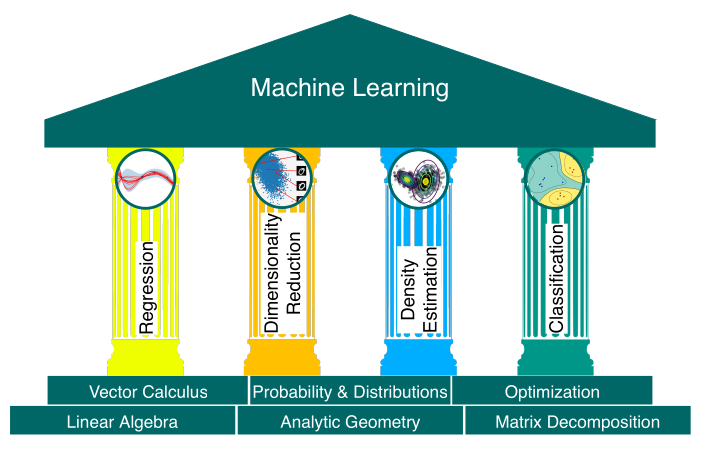

# Forward Summarized

- **Machine learning's challenge**: While machine learning becomes more accessible through software packages, practitioners may overlook the underlying design choices and limitations of algorithms due to **abstraction**.
- Anyone who wants to learn Machine Learning needs to focus on **Key knowledge areas**:
  - Programming
  - Large-scale computation
  - Mathematics and statistics
- Since ML is usally thought in EECS dept, people are more exposed to first and second areas compared to the third one. 
- **Problem with traditional resources**: Many machine learning courses and textbooks focus on algorithms, assuming familiarity with advanced mathematics.
- **Goal of the book**: Bridge the gap between mathematics and machine learning by presenting foundational mathematical concepts.
  - Focus on **practical relevance** of mathematical concepts for machine learning.
  - Encourage readers to learn mathematics through **machine learning applications**.
- **Content focus**: Unlike typical books focused on algorithms or programming, this book highlights the **mathematical principles** behind machine learning models.
  - Provides a **concise overview** of key mathematical concepts.
  - Offers **resources for further study** to help connect theoretical questions to practical applications.
- **Target audience**:
  - **Undergraduate students**.
  - **Online learners** of machine learning.
- **Assumed prior knowledge**: Basic high school mathematics (derivatives, integrals, geometric vectors).
- **Style**: **Academic** and **precise**, but with additional guidance and comments to help readers connect concepts to the larger picture.

---

# Table Of Symbols

| Symbol | Typical Meaning |
|--------|-----------------|
| $a, b, c, \alpha, \beta, \gamma$ | Scalars are lowercase |
| $x, y, z$ | Vectors are bold lowercase |
| $A, B, C$ | Matrices are bold uppercase |
| $x^\top , A^\top$ | Transpose of a vector or matrix |
| $A^{-1}$ | Inverse of a matrix |
| $\langle x, y \rangle$ | Inner product of x and y |
| $x^\top y$ | Dot product of x and y |
| $B = (b_1 , b_2 , b_3 )$ | (Ordered) tuple |
| $B = [b_1 , b_2 , b_3 ]$ | Matrix of column vectors stacked horizontally |
| $B = \{b_1 , b_2 , b_3 \}$ | Set of vectors (unordered) |
| $\mathbb{Z}, \mathbb{N}$ | Integers and natural numbers, respectively |
| $\mathbb{R}, \mathbb{C}$ | Real and complex numbers, respectively |
| $\mathbb{R}^n$ | n-dimensional vector space of real numbers |
| $\forall x$ | Universal quantifier: for all x |
| $\exists x$ | Existential quantifier: there exists x |
| $a := b$ | a is defined as b |
| $a =: b$ | b is defined as a |
| $a \propto b$ | a is proportional to b, i.e., $a = \text{constant} \cdot b$ |
| $g \circ f$ | Function composition: “g after f” |
| $\iff$ | If and only if |
| $\implies$ | Implies |
| $A, C$ | Sets |
| $a \in A$ | a is an element of set A |
| $\emptyset$ | Empty set |
| $A \setminus B$ | A without B : the set of elements in A but not in B |
| $D$ | Number of dimensions; indexed by $d = 1, \dots, D$ |
| $N$ | Number of data points; indexed by $n = 1, \dots, N$ |
| $\mathbb{I}_m$ | Identity matrix of size $m \times m$ |
| $0_{m,n}$ | Matrix of zeros of size $m \times n$ |
| $1_{m,n}$ | Matrix of ones of size $m \times n$ |
| $e_i$ | Standard/canonical vector (where $i$ is the component that is 1) |
| $\dim$ | Dimensionality of vector space |
| $\text{rk}(A)$ | Rank of matrix A |
| $\text{Im}(\Phi)$ | Image of linear mapping $\Phi$ |
| $\text{ker}(\Phi)$ | Kernel (null space) of a linear mapping $\Phi$ |
| $\text{span}[b_1]$ | Span (generating set) of $b_1$ |
| $\text{tr}(A)$ | Trace of A |
| $\text{det}(A)$ | Determinant of A |
| $\| \cdot \|$ | Absolute value or determinant (depending on context) |
| $\|\| \cdot \|\|$ | Norm; Euclidean, unless specified |
| $\lambda$ | Eigenvalue or Lagrange multiplier |
| $\mathbb{E}_\lambda$ | Eigenspace corresponding to eigenvalue $\lambda$ |
| $x^\perp y$ | Vectors $x$ and $y$ are orthogonal |
| $V$ | Vector space |
| $V^\perp$ | Orthogonal complement of vector space $V$ |
| $\sum_{n=1}^N x_n$ | Sum of the $x_n$: $x_1 + \dots + x_N$ |
| $\prod_{n=1}^N x_n$ | Product of the $x_n$: $x_1 \cdot \dots \cdot x_N$ |
| $\theta$ | Parameter vector |
| $\frac{\partial f}{\partial x}$ | Partial derivative of $f$ with respect to $x$ |
| $\frac{d f}{d x}$ | Total derivative of $f$ with respect to $x$ |
| $\nabla$ | Gradient |
| $f^* = \min_x f(x)$ | The smallest function value of $f$ |
| $x^* \in \text{arg min}_x f(x)$ | The value $x^*$ that minimizes $f$ |
| $L$ | Lagrangian |
| $L_n$ | Negative log-likelihood |
| $\binom{n}{k}$ | Binomial coefficient, $n$ choose $k$ |
| $V_X [x]$ | Variance of $x$ with respect to the random variable $X$ |
| $E_X [x]$ | Expectation of $x$ with respect to the random variable $X$ |
| $\text{Cov}_{X,Y} [x, y]$ | Covariance between $x$ and $y$ |
| $X \perp Y \| Z$ | $X$ is conditionally independent of $Y$ given $Z$ |
| $X \sim p$ | Random variable $X$ is distributed according to $p$ |
| $N(\mu, \Sigma)$ | Gaussian distribution with mean $\mu$ and covariance $\Sigma$ |
| $\text{Ber}(\mu)$ | Bernoulli distribution with parameter $\mu$ |
| $\text{Bin}(N, \mu)$ | Binomial distribution with parameters $N, \mu$ |
| $\text{Beta}(\alpha, \beta)$ | Beta distribution with parameters $\alpha, \beta$ |

# Table of Abbreviations and Acronyms

| Acronym | Meaning |
|---------|---------|
| e.g. | Exempli gratia (Latin: for example) |
| GMM | Gaussian mixture model |
| i.e. | Id est (Latin: this means) |
| i.i.d. | Independent, identically distributed |
| MAP | Maximum a posteriori |
| MLE | Maximum likelihood estimation/estimator |
| ONB | Orthonormal basis |
| PCA | Principal component analysis |
| PPCA | Probabilistic principal component analysis |
| REF | Row-echelon form |
| SPD | Symmetric, positive definite |
| SVM | Support vector machine |

---

# Machine Learning

Machine learning is the latest in a long line of attempts to distill human knowledge and reasoning into a form that is suitable for constructing machines and engineering automated systems.

### Definition:
- **Machine Learning** involves designing algorithms to **automatically extract valuable information from data**.
  - Focus is on **automatic methodologies** that are general-purpose.
  - Aim: Apply methodologies to various datasets to produce meaningful results.

### Objectives:
- Design **general-purpose methodologies** for pattern recognition in data.
- Ensure models are capable of **generalizing to new, unseen datasets** effectively.

## Core Concepts:
1. **Data**  
   - **Central to Machine Learning**: Machine learning is inherently data-driven.  
   - Goal: Extract **valuable patterns** from data **without requiring much domain-specific expertise**.  
   - Example:  
     - A large corpus of documents (e.g., books in libraries) can be analyzed to automatically identify shared topics (e.g., Latent Dirichlet Allocation, Hoffman et al., 2010).
   - Data is assumed to be preprocessed into a **numerical representation** (e.g., vectors).  
   - Vectors can be interpreted as:  
     - **Array of numbers** (computer science view).  
     - **Arrow with direction and magnitude** (physics view).  
     - **Object obeying addition and scaling** (mathematical view).  
   - These numerical representations (vectors) are essential for processing and analyzing data in machine learning tasks.

2. **Model**  
   - Describes a process for **generating data**, similar to the given dataset.  
   - Acts as a **simplified version** of the real-world data-generating process.  
   - Goals:  
     - Extract **hidden patterns**.  
     - Predict outcomes without real-world experiments.
   - Example:  
     - In regression, the model describes a function mapping **inputs to real-valued outputs**.  

3. **Learning**  
   - A model is said to **learn** if its **performance improves** on a task after using data.  
     - Paraphrasing Mitchell (1997):  
       > "A model learns from data if its performance improves after the data is taken into account."  
   - Learning involves:  
     - Automatically finding patterns and structures in the data.  
     - Uses data to **optimize model parameters** based on a utility function (e.g., loss function) to minimize error and achieve better performance.  
   - Goal: Develop models that **generalize well** to **unseen data** (future scenarios) and avoid overfitting (memorizing the data).  
     - Training well on seen data ≠ good performance on unseen data.

Let us **summarize** the main concepts of machine learning:
* We represent data as vectors.
* We choose an appropriate model, either using the probabilistic or optimization view.
* We learn from available data by using numerical optimization methods with the aim that the model performs well on data not used for training.

---

## Importance of Mathematical Foundations in Machine Learning  
- **Mathematical foundations** are crucial for understanding the principles behind machine learning systems.  
- Benefits:  
  - Enables **creation of new solutions**.  
  - Aids in **understanding and debugging** existing methods.  
  - Highlights the **assumptions and limitations** of current methodologies.  
- Essential for building on the **successes of machine learning** and advancing the field.  

---

## Ambiguity in Machine Learning Terms:  
* **"Algorithm"**:  
  * **Sense 1**: A system that makes predictions based on input data (**predictor**).  
  * **Sense 2**: A system that adapts internal parameters of the predictor to perform well on unseen data (**training**).  
  * Context is key to understanding the intended meaning since expressions can mean different things depending on the context.  

---

# Machine Learning in Two Parts

  
**Figure 1.1**: The four foundational pillars of machine learning: **Regression**, **Dimensionality Reduction**, **Density Estimation**, and **Classification**, supported by the mathematical concepts of **linear algebra**, **analytic geometry**, **probability theory**, and **vector calculus**. These pillars are essential for building machine learning systems that can generalize well to unseen data.

## **Part I: Mathematics for Machine Learning**  

### Mathematical Foundations of Machine Learning (Figure 1.1):  
1. **Numerical Representation**:  
   - **Data as vectors**: Individual numerical data points.  
   - **Data as matrices**: Tables of numerical data.  
   - Studied in **linear algebra** (introduced in Chapter 2).

2. **Similarity and Distance**:  
   - **Goal**: Compare two vectors (representing objects) to determine their **similarity**.  
   - Vectors with high similarity → Predicted to have **similar outputs**.  
   - Operations for measuring similarity and distance are covered in **analytic geometry** (Chapter 3).

3. **Matrix Operations and Decomposition**:  
   - **Matrix operations** are essential for interpreting data and improving learning efficiency.  
   - **Matrix decomposition** provides intuitive insights into the structure of data.  
   - Covered in Chapter 4.  

4. **Quantifying Noise and Uncertainty**:  
   - Data often contains **noise** (random variability) masking the true signal.  
   - **Probability theory**:  
     - Quantifies noise.  
     - Allows predictors to express **uncertainty** about predictions.  
   - Discussed in Chapter 6.

---

### Additional Mathematical Tools:  
1. **Vector Calculus**:  
   - **Gradients**: Indicate the direction for optimization (maximizing/minimizing functions).  
   - Introduced in Chapter 5.

2. **Optimization**:  
   - Uses gradients to optimize model parameters.  
   - Covered in Chapter 7.  

---

## **Part II: Machine Learning**  

### Overview:  
- Part II will explore how the **four pillars of machine learning** (from Figure 1.1) are grounded in the mathematical concepts covered in Part I.  
- Chapters progress in **increasing difficulty** as we apply these tools to build and understand machine learning models.

---

### Four Pillars of Machine Learning:  

1. **Regression**  
   - Focus: **Linear regression** (Chapter 9).  
   - Objective: Map inputs $x \in \mathbb{R}^D$ to observed labels $y \in \mathbb{R}$.  
   - Topics Covered:  
     - **Classical model fitting**: Maximum likelihood and maximum a posteriori estimation.  
     - **Bayesian linear regression**: Parameters are integrated out rather than optimized.  

2. **Dimensionality Reduction**  
   - Pillar: **Principal Component Analysis (PCA)** (Chapter 10).  
   - Objective: Find a **lower-dimensional representation** of high-dimensional data $x \in \mathbb{R}^D$.  
   - Characteristics:  
     - Models the data without using labels.  
     - Focus on uncovering compact representations for ease of analysis.  

3. **Density Estimation**  
   - Pillar: **Gaussian Mixture Models (GMM)** (Chapter 11).  
   - Objective: Identify a **probability distribution** that describes the data.  
   - Characteristics:  
     - No labels associated with data points.  
     - Unlike dimensionality reduction, seeks a **density model** rather than a low-dimensional representation.  
   - Method: Iterative schemes to estimate parameters.  

4. **Classification**  
   - Pillar: **Support Vector Machines (SVM)** (Chapter 12).  
   - Objective: Classify inputs $x$ with corresponding labels $y$.  
   - Characteristics:  
     - Labels in classification are **integers** (as opposed to real-valued in regression).  
     - Special techniques are needed to handle integer labels.  

---

### Key Takeaway:  
The **mathematical foundation** in Part I includes **linear algebra, analytic geometry, probability theory, vector calculus, and optimization**, providing the tools needed to understand and apply machine learning.  

Part II connects these mathematical foundations to the practical pillars of machine learning. Each chapter builds on the previous ones to cover core methodologies, **Regression**, **Dimensionality Reduction**, **Density Estimation**, and **Classification**.  

Focus throughout is on building models that **generalize well** to unseen data.

---