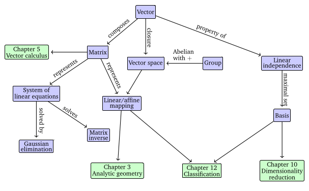
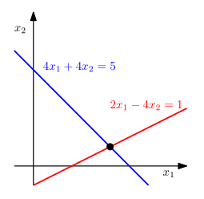

# Linear Algebra and Vectors

**Algebra**: A mathematical structure involving objects (symbols) and rules for manipulating them.
  
**Linear Algebra**: The study of vectors and the rules to manipulate them.

**Abstract Definition of Vectors**: Any object that can be added and multiplied by scalars, and still behaves like a vector, can be considered a vector.

**Notation**: Vectors are presented in bold lower-case letters, e.g. **$\mathbf{x}$**

**Key Properties of Vectors**:

1. **Addition**:  
   Vectors can be added together to form another vector of the same kind.  
   - Example: Consider two vectors $\mathbf{x}, \mathbf{y}$, now $\mathbf{x} + \mathbf{y}$ is also a vector.

2. **Scalar Multiplication**:  
   Vectors can be multiplied by a scalar (real number) to form another vector.  
   - Example: $\bold{A}\mathbf{x}$ is also a vector, where $\bold{A}$ is a scalar and $\mathbf{x}$ is a vector.

**Examples of Vector Objects**:

1. **Geometric Vectors**:
   - These are the familiar directed segments from high school math and physics, often denoted as $\vec{x}$ and $\vec{y}$.
   - **Addition**: Two geometric vectors $\vec{x}$ and $\vec{y}$ can be added to produce a third vector $\vec{z}$, such that $\vec{x} + \vec{y} = \vec{z}$.
   - **Scalar Multiplication**: A geometric vector can be multiplied by a scalar $\lambda \in \mathbb{R}$ to scale its magnitude, resulting in a new geometric vector $\lambda \vec{x}$.
   - **Intuition**: Geometric vectors help us understand the concepts of direction and magnitude visually, which aids in reasoning about mathematical operations.

2. **Polynomials**:
   - Polynomials are also considered vectors, although they are abstract objects, unlike the concrete geometric vectors.
   - **Addition**: Two polynomials can be added together, resulting in another polynomial.
   - **Scalar Multiplication**: A polynomial can be multiplied by a scalar $\lambda \in \mathbb{R}$, producing a new polynomial.
   - **Abstract Nature**: Polynomials represent vectors in the same way as geometric vectors, despite their abstract nature.

3. **Audio Signals**:
   - Audio signals are sequences of numbers and are considered vectors.
   - **Addition**: Two audio signals can be added together, resulting in a new audio signal.
   - **Scalar Multiplication**: Scaling an audio signal by a scalar $\lambda \in \mathbb{R}$ results in a new audio signal.
   - **Real-World Applications**: This property of audio signals allows for practical operations like mixing and volume control in digital audio processing.

4. **Elements of $\mathbb{R}^n$ (Tuples of Real Numbers)**:
   - Vectors can be represented as tuples of $n$ real numbers, known as elements of $\mathbb{R}^n$.
   - Example: A vector in $\mathbb{R}^3$ could be $\mathbf{a} = \begin{bmatrix} 1 \\ 2 \\ 3 \end{bmatrix}$.
   - **Addition**: Adding two vectors $\mathbf{a}$ and $\mathbf{b}$ component-wise results in another vector $\mathbf{c} \in \mathbb{R}^n$.
   - **Scalar Multiplication**: Multiplying a vector $\mathbf{a}$ by a scalar $\lambda$ results in a scaled vector $\lambda \mathbf{a}$.
   - **Computer Science Connection**: Vectors in $\mathbb{R}^n$ correspond to arrays of real numbers in programming languages, facilitating efficient implementation of vector operations in algorithms.

These examples demonstrate how vectors, despite originating from different domains such as geometry, polynomials, and audio signals, all **adhere** to the fundamental operations of addition and scalar multiplication. This commonality enables the application of linear algebra across a wide range of fields, from mathematics to engineering and computer science.

> **Note**:  
> - **Linear algebra** emphasizes the similarities between various vector concepts, focusing on their ability to be added and scaled.
> - The primary focus is on vectors in $\mathbb{R}^n$, as most linear algebra algorithms are designed for this space.
> - In many applications, data is represented as vectors in $\mathbb{R}^n$.
> - Most discussions revolve around **finite-dimensional vector spaces**, where there is a 1:1 correspondence between vectors and $\mathbb{R}^n$.

**Closure**: A key mathematical idea, which asks: What is the set of all possible results from performing a given set of operations? 

**Vector Space as closure for Vectors**: For vectors, closure refers to the set of all vectors that can be formed by starting with a small set of vectors and applying addition and scalar multiplication. This results in a **vector space**, a fundamental concept that underlies many machine learning techniques.

---

  
*A mind map of Linear Algebra, depicting its concepts, connections, and applications.*

---

# Systems of Linear Equations

A problem can be expressed as a **collection of statements**, which can then be translated into a **system of equations**, and subsequently solved using the **tools of linear algebra**.

Let's consider a problem where a company produces multiple products using different resources. 

### Problem Setup

- **Products**: The company produces $N_1, N_2, \ldots, N_n$ products.
- **Resources**: To produce each product, certain resources $R_1, R_2, \ldots, R_m$ are required.
- **Resource Requirements**: To produce one unit of product $N_j$, the company requires $\bold{A}_{ij}$ units of resource $R_i$. This means that for each product $N_j$, the amount of resource $R_i$ used is represented by $\bold{A}_{ij}$, where $i$ represents the resource index $\{1, 2, ..., m\}$ and $j$ represents the product index $\{1, 2, ..., n\}$.

### Objective

The goal is to find the optimal production plan, i.e., how many units $x_j$ of product $N_j$ should be produced, given that the company has a total of $\bold{B}_i$ units of resource $R_i$ available. The production plan should ideally use all available resources without any leftover.

### Mathematical Formulation

- **Total Resource Usage**: If $x_1, x_2, \ldots, x_n$ are the quantities of products $N_1, N_2, \ldots, N_n$ that are produced, then the total amount of resource $R_i$ used is:

$$
a_{i1}x_1 + a_{i2}x_2 + \cdots + a_{in}x_n
$$
* Where:
  - $\bold{A}_{ij}$ is the amount of resource $R_i$ needed to produce one unit of product $N_j$.
  - $x_j$ is the number of units of product $N_j$ being produced.

- **Constraints**: The total amount of each resource $R_i$ used must equal the available amount $\bold{B}_i$. Therefore, for each resource $R_i$, we have the following equation:

$$
a_{i1} x_1 + a_{i2} x_2 + \cdots + a_{in} x_n = b_i
$$

This equation must hold true for every resource $R_i$ (for $i = 1, 2, \ldots, m$).

### System of Equations

Thus, the **optimal production plan** $(x_1, x_2, \ldots, x_n)$ must satisfy a system of $m$ linear equations:

$$
a_{11} x_1 + a_{12} x_2 + \cdots + a_{1n} x_n = b_1
$$

$$
a_{21} x_1 + a_{22} x_2 + \cdots + a_{2n} x_n = b_2
$$

$$
\vdots
$$

$$
a_{m1} x_1 + a_{m2} x_2 + \cdots + a_{mn} x_n = b_m
$$

Here, $\bold{A}_{ij}$ are the coefficients that represent the resource requirements for producing each product, and $\bold{B}_i$ is the total amount of resource $R_i$ available.

This is a classic example of a **general form of *system of linear equations*** where the goal is to solve for the values of $x_1, x_2, \ldots, x_n$ that satisfy the constraints for all available resources.

### Key Points:
1. The system is **linear** because each equation is a linear combination of the unknowns $x_1, x_2, \dots, x_n$.
2. The solution to this system is an **n-tuple** $(x_1, x_2, \dots, x_n) \in \mathbb{R}^n$, representing the quantities of the products to be produced.
3. A **solution** to this system is any vector $(x_1, x_2, \dots, x_n)$ that satisfies all the equations **simultaneously**.

### Concept of Solution:
- The vector $(x_1, x_2, \dots, x_n)$ is a **solution** to the system of equations if, when substituted into the left-hand side of the equations, the result equals the corresponding values $\bold{B}_1, b_2, \dots, b_m$ on the right-hand side.
- Each solution represents a feasible set of production quantities, where all resources are perfectly used without any leftover.

---

## Types of Solutions to System of Linear Equations

### System 1: No Solution
Consider the system of linear equations:

$$
\begin{aligned}
\text{(1)} \quad & x_1 + x_2 + x_3 = 3 \\
\text{(2)} \quad & x_1 - x_2 + 2x_3 = 2 \\
\text{(3)} \quad & 2x_1 \quad + \quad 3x_3 = 1
\end{aligned}
$$

- **Adding $(1)$ and $(2)$:**
  $$
  (x_1 + x_2 + x_3) + (x_1 - x_2 + 2x_3) = 3 + 2
  $$
  Simplifying:
  $$
  2x_1 + 3x_3 = 5
  $$

- **Contradiction with $(3)$:**
  However, $(3)$ is $2x_1 + 3x_3 = 1$. This leads to a contradiction, since $2x_1 + 3x_3$ cannot be both 5 and 1 simultaneously.

Thus, the system has **no solution**.

---

### System 2: Unique Solution
Now consider the system of equations:
$$
\begin{aligned}
\text{(1)} \quad & x_1 + x_2 + x_3 = 3 \\
\text{(2)} \quad & x_1 - x_2 + 2x_3 = 2 \\
\text{(3)} \quad & x_2 + x_3 = 2 \\
\end{aligned}
$$

- **From $(1)$ and $(3)$:**
  From equation $(3)$, we have:
  $$
  x_2 = 2 - x_3
  $$
  Substituting this into $(1)$:
  $$
  x_1 + (2 - x_3) + x_3 = 3
  $$
  Simplifying:
  $$
  x_1 + 2 = 3 \quad \Rightarrow \quad x_1 = 1
  $$

- **Substitute $x_1 = 1$ into $(2)$:**
  Substituting $x_1 = 1$ into $(2)$ gives:
  $$
  1 - x_2 + 2x_3 = 2
  $$
  Simplifying:
  $$
  -x_2 + 2x_3 = 1
  $$
  Substitute $x_2 = 2 - x_3$ into this equation:
  $$
  -(2 - x_3) + 2x_3 = 1
  $$
  Simplifying:
  $$
  -2 + x_3 + 2x_3 = 1 \quad \Rightarrow \quad 3x_3 = 3 \quad \Rightarrow \quad x_3 = 1
  $$

- **Finally, find $x_2$:**
  Substituting $x_3 = 1$ into $x_2 = 2 - x_3$:
  $$
  x_2 = 2 - 1 = 1
  $$

Thus, the unique solution is $(x_1, x_2, x_3) = (1, 1, 1)$.

---

### System 3: Infinite Solutions
Consider the system:
$$
\begin{aligned}
\text{(1)} \quad & x_1 + x_2 + x_3 = 3 \\
\text{(2)} \quad & x_1 - x_2 + 2x_3 = 2 \\
\text{(3)} \quad & 2x_1 + 3x_3 = 5 \\
\end{aligned}
$$

- **Redundancy in the system:**
  Notice that:
  $$
  (1) + (2) = (3)
  $$
  Therefore, equation $(3)$ is redundant, and we can omit it.

- **Solve the system with only $(1)$ and $(2)$:**
  From equation $(1)$, $x_1 + x_2 + x_3 = 3$, we can express $x_1$ as:
  $$
  x_1 = 3 - x_2 - x_3
  $$

  Substitute this into equation $(2)$:
  $$
  (3 - x_2 - x_3) - x_2 + 2x_3 = 2
  $$
  Simplifying:
  $$
  3 - 2x_2 + x_3 = 2 \quad \Rightarrow \quad -2x_2 + x_3 = -1 \quad \Rightarrow \quad x_3 = 2x_2 - 1
  $$

  Let $x_3 = a$ (a free variable). Then:
  $$
  x_3 = a \quad \Rightarrow \quad x_2 = \frac{a + 1}{2}
  $$

- **Find $x_1$:**
  Now substitute $x_2 = \frac{a + 1}{2}$ and $x_3 = a$ into $x_1 = 3 - x_2 - x_3$:
  $$
  x_1 = 3 - \frac{a + 1}{2} - a
  $$
  Simplifying:
  $$
  x_1 = \frac{5 - 3a}{2}
  $$

Thus, the solution is:
$$
(x_1, x_2, x_3) = \left( \frac{5 - 3a}{2}, \frac{a + 1}{2}, a \right), \quad a \in \mathbb{R}
$$

This represents **infinitely many solutions**, depending on the value of $\bold{A}$.

---

> **Conclusion**: For a real-valued system of linear equations we obtain either no, exactly one, or infinitely many solutions.

---

## Geometric Interpretation of Systems of Linear Equations

### Two Variables

In a system of linear equations with two variables $x_1$ and $x_2$, each linear equation represents a line on the $x_1x_2$-plane. The solution to the system must satisfy all equations **simultaneously**, so the solution set corresponds to the intersection of these lines. The intersection could take one of the following forms:
- **A single point**: When the lines intersect at one unique point.
- **A line**: If the equations represent the same line.
- **Empty**: If the lines are parallel and do not intersect.

For example, consider the system of equations:
$$
4x_1 + 4x_2 = 5
$$
$$
2x_1 - 4x_2 = 1
$$
The solution space for this system is the point $(x_1, x_2) = (1, \frac{4}{1})$, which corresponds to the intersection of the two lines.

  
*Geometric interpretation of a system of linear equations with two variables, showcasing a single unique solution.*

---

### Three Variables

For three variables, each linear equation represents a plane in three-dimensional space. When solving the system, the solution set is the intersection of these planes. The possible outcomes are:
- **A point**: If the planes intersect at a single point.
- **A line**: If the planes intersect along a line.
- **A plane**: If all the planes coincide or intersect in a common plane.
- **Empty**: If the planes do not have a common intersection.

---

## Compact Representation of Systems of Linear Equations

Going back to our system of linear equations, 

$$
a_{11} x_1 + a_{12} x_2 + \cdots + a_{1n} x_n = b_1 \\

a_{21} x_1 + a_{22} x_2 + \cdots + a_{2n} x_n = b_2 \\

\vdots \\

a_{m1} x_1 + a_{m2} x_2 + \cdots + a_{mn} x_n = b_m \\
$$

we will now try to represent them compactly by collecting the coefficients of each variable into vectors:

$$
\left[
\begin{array}{c}
a_{11} \\
a_{21} \\
\vdots \\
a_{m1}
\end{array}
\right] x_1
+
\left[
\begin{array}{c}
a_{12} \\
a_{22} \\
\vdots \\
a_{m2}
\end{array}
\right] x_2
+ \cdots
+ 
\left[
\begin{array}{c}
a_{1n} \\
a_{2n} \\
\vdots \\
a_{mn}
\end{array}
\right] x_n
=
\left[
\begin{array}{c}
b_1 \\
b_2 \\
\vdots \\
b_m
\end{array}
\right]
$$

This shows how each variable $x_1, x_2, \ldots, x_n$ is associated with its respective column of coefficients from the matrix.

Finally, we can express the entire system in matrix form as:

$$
\begin{bmatrix}
a_{11} & a_{12} & \cdots & a_{1n} \\
a_{21} & a_{22} & \cdots & a_{2n} \\
\vdots  & \vdots  & \ddots & \vdots \\
a_{m1} & a_{m2} & \cdots & a_{mn}
\end{bmatrix}
\begin{bmatrix}
x_1 \\
x_2 \\
\vdots \\
x_n
\end{bmatrix}
=
\begin{bmatrix}
b_1 \\
b_2 \\
\vdots \\
b_m
\end{bmatrix}
$$

This compact matrix-vector form makes it easy to solve the system using matrix operations.

# Matrices

Since we have a *matrix* in hand, let's talk about them and then go back to solving the above equation using matrix operations.

Matrices are one of the most important concepts in linear algebra, playing a central role in **representing systems of linear equations**, **linear functions** (or mappings), and **transformations**. In addition to their use in equations, matrices have many other properties and applications.

**Matrix Definition**: A matrix $\bold{A}$ is an ordered collection of real numbers $\bold{A}_{ij}$ arranged in $m$ rows and $n$ columns. Matrices are often denoted by capital letters, and the number of rows is represented by $m$, and the number of columns is represented by $n$.

For example, a matrix $\bold{A}$ of size $m \times n$ (with $m$ rows and $n$ columns) looks like this:

$$
\bold{A} = \begin{bmatrix}
a_{11} & a_{12} & \cdots & a_{1n} \\
a_{21} & a_{22} & \cdots & a_{2n} \\
\vdots  & \vdots  & \ddots & \vdots \\
a_{m1} & a_{m2} & \cdots & a_{mn}
\end{bmatrix}
$$

Where $\bold{A}_{ij} \in \mathbb{R}$ represents the element in the $i$-th row and $j$-th column.

For example, a $2 \times 3$ matrix could look like:

$$
\bold{A} = \begin{bmatrix}
1 & 2 & 3 \\
4 & 5 & 6
\end{bmatrix}
$$

This matrix has 2 rows and 3 columns, and the elements are real numbers.

By convention (1, n)-matrices are called **rows** and (m, 1)-matrices are called **columns**. These special matrices are also called **row/column vectors**. A vector is always represented as a column vectors. For e.g. 
$$
\bold{c} = \begin{bmatrix}
1 \\
2 \\
3
\end{bmatrix}
$$

---

### Matrix as a Vector

It is also useful to think of a matrix as a **long vector**. You can "flatten" or "reshape" the matrix by stacking all of its columns into a single long vector. This is especially useful in programming and when performing matrix operations.

For example, if we have a matrix $\bold{A} \in \mathbb{R}^{m \times n}$, we can reshape it into a vector $\bold{A} \in \mathbb{R}^{mn}$ by stacking all of its columns.

For example consider the matrix:

$$
A = \begin{bmatrix}
1 & 2 & 3 \\
4 & 5 & 6
\end{bmatrix}
$$

We can reshape it into the vector:

$$
a = \begin{bmatrix}
1 \\
4 \\
2 \\
5 \\
3 \\
6
\end{bmatrix}
$$

This is a 6-dimensional vector, which contains all the elements of the original matrix.

---

### Identity Matrix

The **identity matrix**, denoted as $\bold{I}_n$, is a special type of square matrix in $\mathbb{R}^{n \times n}$. It is defined as follows:

$$
\bold{I}_n = \begin{bmatrix}
1 & 0 & \cdots & 0 & \cdots & 0 \\
0 & 1 & \cdots & 0 & \cdots & 0 \\
\vdots & \vdots & \ddots & \vdots & \ddots & \vdots \\
0 & 0 & \cdots & 1 & \cdots & 0 \\
\vdots & \vdots & \ddots & \vdots & \ddots & \vdots \\
0 & 0 & \cdots & 0 & \cdots & 1
\end{bmatrix} \in \mathbb{R}^{n \times n}
$$

**Notation**: 
$\bold{I}_n$ is the $n \times n$ matrix with entries $i_{ij}$ such that:
$$
i_{ij} = 
\begin{cases} 
1 & \text{if } i = j \\ 
0 & \text{if } i \neq j 
\end{cases}
$$

---

### Main Diagonal of a Matrix
The **main diagonal** (also referred to as the **principal diagonal**, **primary diagonal**, **leading diagonal**, or **major diagonal**) of a matrix $\bold{A}$ consists of the entries $\bold{A}_{ij}$ where the row index $i$ equals the column index $j$. That is, the main diagonal includes the elements $\bold{A}_{11}, A_{22}, A_{33}, \dots, A_{nn}$ for a square matrix.

For example, for the matrix:

$$
A = \begin{pmatrix} 1 & 2 & 3 \\ 4 & 5 & 6 \\ 7 & 8 & 9 \end{pmatrix}
$$

The main diagonal is:

$$
A_{11}, A_{22}, A_{33} \quad \text{which is} \quad 1, 5, 9
$$

---

## Properties of Matrices

### Matrix Addition

Matrix addition is the operation of adding two matrices of the **same size element-wise**. Given two matrices $\bold{A} \in \mathbb{R}^{m \times n}$ and $\bold{B} \in \mathbb{R}^{m \times n}$, their sum $\bold{A} + \bold{B}$ is defined as:

$$
\bold{A} + \bold{B} := \begin{bmatrix}
a_{11} + b_{11} & \cdots & a_{1n} + b_{1n} \\
\vdots & \ddots & \vdots \\
a_{m1} + b_{m1} & \cdots & a_{mn} + b_{mn}
\end{bmatrix}
\in \mathbb{R}^{m \times n}
$$

In other words, each element of the resulting matrix is the sum of the corresponding elements from matrices $\bold{A}$ and $\bold{B}$. This operation requires that both matrices have the same dimensions (same number of rows and columns).

Example:

$$
A = \begin{bmatrix}
1 & 2 & 3 \\
4 & 5 & 6
\end{bmatrix}
\quad \text{and} \quad
B = \begin{bmatrix}
7 & 8 & 9 \\
10 & 11 & 12
\end{bmatrix}
$$

$$
A + B = \begin{bmatrix}
1 + 7 & 2 + 8 & 3 + 9 \\
4 + 10 & 5 + 11 & 6 + 12
\end{bmatrix}
= \begin{bmatrix}
8 & 10 & 12 \\
14 & 16 & 18
\end{bmatrix}
$$

---

### Matrix Multiplication

Matrix multiplication is a more complex operation. To multiply two matrices $\bold{A} \in \mathbb{R}^{m \times n}$ and $\bold{B} \in \mathbb{R}^{n \times k}$, the resulting matrix $C = AB \in \mathbb{R}^{m \times k}$ is obtained by taking the dot product of rows of $\bold{A}$ with columns of $\bold{B}$.

Each element $c_{ij}$ of the product matrix $C = AB$ is computed as the **dot product** of the $i$-th row of matrix $\bold{A}$ and the $j$-th column of matrix $\bold{B}$:

$$
c_{ij} = a_i^\top b_j, \quad \text{where} \quad a_i, b_j \in \mathbb{R}^n
$$

Alternatively, we can express this as:

$$
c_{ij} = \sum_{l=1}^{n} a_{il} b_{lj}, \quad i = 1, \dots, m, \, j = 1, \dots, k
$$

This means to compute element $c_{ij}$, you multiply the elements of the $i$-th row of $\bold{A}$ with the $j$-th column of $\bold{B}$ and sum them up.

**Conditions for Matrix Multiplication**

Matrix multiplication is only possible if the **number of columns** in the first matrix matches the **number of rows** in the second matrix. This means that, for matrix multiplication to be defined:

- The matrix $\bold{A} \in \mathbb{R}^{m \times n}$ can be multiplied with matrix $\bold{B} \in \mathbb{R}^{n \times k}$, where the number of columns in $\bold{A}$ (denoted as $n$) is the same as the number of rows in $\bold{B}$ (also denoted as $n$).

Thus, if we multiply an $n \times k$-matrix $\bold{A}$ with a $k \times m$-matrix $\bold{B}$, the resulting product $C = AB$ will be an $n \times m$-matrix.

---

**Non-commutative Property:**  
Matrix multiplication is **not commutative**, meaning that in general, $\bold{A}\bold{B} \neq \bold{B}\bold{A}$. The order of multiplication matters. Even if both matrix
multiplications $\bold{A}\bold{B}$ and $\bold{B}\bold{A}$ are defined, the dimensions of the results can be different.

---

**Associativity of Matrix Multiplication:**  
For any matrices $\bold{A} \in \mathbb{R}^{m \times n}$, $\bold{B} \in \mathbb{R}^{n \times p}$, and $C \in \mathbb{R}^{p \times q}$, matrix multiplication is associative, meaning:

$$
(AB)C = A(BC)
$$
This property holds regardless of how we group the matrices during multiplication.

---

**Distributivity of Matrix Multiplication:**  
For any matrices $\bold{A}, B \in \mathbb{R}^{m \times n}$, and $C, D \in \mathbb{R}^{n \times p}$, matrix multiplication distributes over both addition and subtraction:

$$
(A + B)C = AC + BC
$$
$$
A(C + D) = AC + AD
$$
These properties allow us to distribute matrix multiplication across addition and subtraction operations.

---

**Multiplication with the Identity Matrix:**  
For any matrix $\bold{A} \in \mathbb{R}^{m \times n}$, multiplying by the identity matrix $I$ of appropriate dimensions does not change the matrix:

$$
I_m A = A = A I_n
$$
Here, $I_m$ is the identity matrix of size $m \times m$, and $I_n$ is the identity matrix of size $n \times n$. It’s important to note that $I_m \neq I_n$ unless $m = n$. 

---

### Hadamard Product

The **Hadamard Product**, also known as the **element-wise product**, is defined for matrices of the same dimensions. It involves multiplying corresponding elements of two matrices directly.

**Definition**:
If $\bold{A} = [a_{ij}]$ and $\bold{B} = [b_{ij}]$ are matrices of the same size $m \times n$, their Hadamard Product $\bold{C} = \bold{A} \odot \bold{B}$ is given by:
$$
c_{ij} = a_{ij} \cdot b_{ij}, \quad \forall \, i = 1, \dots, m, \, j = 1, \dots, n
$$

**Example**:  
Let:
$$
\bold{A} = \begin{bmatrix}
1 & 2 & 3 \\
4 & 5 & 6
\end{bmatrix}, \quad
\bold{B} = \begin{bmatrix}
7 & 8 & 9 \\
10 & 11 & 12
\end{bmatrix}
$$

The Hadamard Product $\bold{C} = \bold{A} \odot \bold{B}$ is computed as:
$$
\bold{C} = \begin{bmatrix}
1 \cdot 7 & 2 \cdot 8 & 3 \cdot 9 \\
4 \cdot 10 & 5 \cdot 11 & 6 \cdot 12
\end{bmatrix}
= \begin{bmatrix}
7 & 16 & 27 \\
40 & 55 & 72
\end{bmatrix}
$$

---

### Inverse of a Matrix

Let $\bold{A} \in \mathbb{R}^{n \times n}$ be a **square matrix**, meaning it has the same number of rows and columns. A matrix $\bold{B} \in \mathbb{R}^{n \times n}$ is said to be the inverse of $\bold{A}$, denoted by $\bold{A}^{-1}$, if the following two conditions hold:

$$
\bold{A}\bold{B} = I_n \quad \text{and} \quad \bold{B}\bold{A} = I_n
$$

where $I_n$ is the identity matrix of size $n \times n$.

- If such a matrix $\bold{B}$ exists, $\bold{A}$ is called **invertible**, **regular**, or **nonsingular**.
- If no inverse exists, $\bold{A}$ is called **singular** or **noninvertible**.

It is important to note that if an inverse exists, it is **unique**.

**Existence of the Inverse of a 2x2 Matrix**  
Consider a 2x2 matrix:

$$
A := \begin{pmatrix} a_{11} & a_{12} \\ a_{21} & a_{22} \end{pmatrix}
\in \mathbb{R^{2 \times 2}}
$$

If we multiply $\bold{A}$ with:

$$
A' := \begin{pmatrix} a_{22} & -a_{12} \\ -a_{21} & a_{11} \end{pmatrix}
$$

We obtain:

$$
AA' = \begin{pmatrix} a_{11}a_{22} - a_{12}a_{21} & 0 \\ 0 & a_{11}a_{22} - a_{12}a_{21} \end{pmatrix} = (a_{11}a_{22} - a_{12}a_{21}) \bold{I_2}
$$

Therefore, 

$$
\bold{A^{-1}} = \frac{1}{a_{11}a_{22} - a_{12}a_{21}} \begin{pmatrix} a_{22} & -a_{12} \\ -a_{21} & a_{11} \end{pmatrix}
$$

Thus, the inverse exists only when ${a}_{11}a_{22} - a_{12}a_{21} \neq 0$, which is the **determinant** of the matrix $\bold{A}$. If the determinant is zero, the matrix is singular and does not have an inverse.

---

### Transpose of a Matrix

Let $\bold{A} \in \mathbb{R}^{m \times n}$ be a matrix with $m$ rows and $n$ columns. The **transpose** of $\bold{A}$, denoted $\bold{A}^\top$, is the matrix $\bold{B} \in \mathbb{R}^{n \times m}$ obtained by swapping the rows and columns of $\bold{A}$. Specifically, the element at position $(i, j)$ in $\bold{A}$ becomes the element at position $(j, i)$ in $\bold{A}^\top$:

$$
B = A^\top \quad \text{where} \quad b_{ij} = a_{ji}
$$

This operation essentially converts the rows of $\bold{A}$ into the columns of $\bold{A}^\top$, and the columns of $\bold{A}$ into the rows of $\bold{A}^\top$.

### Properties of Inverses and Transposes

**Inverse Properties**

1. **Inverse of a Matrix Product:**
   $$
   (AB)^{-1} = B^{-1} A^{-1}
   $$
   The inverse of a product of matrices $\bold{A}$ and $\bold{B}$ is the product of their inverses, but in reverse order. 

2. **Inverse of a Sum:**
   $$
   (A + B)^{-1} \neq A^{-1} + B^{-1}
   $$
   The inverse of a sum of matrices is **not** the sum of their inverses.

3. **Identity Matrix:**
   $$
   A A^{-1} = I = A^{-1} A
   $$
   A matrix $\bold{A}$ multiplied by its inverse $\bold{A}^{-1}$ results in the **identity matrix** $I$, both on the left and right.

**Transpose Properties**

4. **Transpose of a Matrix Product:**
   $$
   (AB)^\top = B^\top A^\top
   $$
   The transpose of a product of two matrices $\bold{A}$ and $\bold{B}$ is the product of their transposes in reverse order.

5. **Transpose of a Sum:**
   $$
   (A + B)^\top = A^\top + B^\top
   $$
   The transpose of the sum of matrices $\bold{A}$ and $\bold{B}$ is equal to the sum of their transposes.

6. **Transpose of a Transpose:**
   $$
   (A^\top)^\top = A
   $$
   The transpose of transpose of a matrix $\bold{A}$ is equal to the original matrix itself.

---

### Symmetric Matrix

A matrix $\bold{A} \in \mathbb{R}^{n \times n}$ is called **symmetric** if:

$$
A = A^\top
$$

This means that a symmetric matrix is equal to its transpose, implying that the elements of the matrix satisfy the condition $\bold{A}_{ij} = a_{ji}$ for all $i$ and $j$. 

**Note:** Only **square matrices** (those with the same number of rows and columns) can be symmetric. For example, a $3 \times 3$ matrix can be symmetric, but a non-square matrix (e.g., $3 \times 2$) cannot be symmetric.

#### Properties of Symmetric Matrices

- If $\bold{A}$ is invertible, then $\bold{A}^\top$ (the transpose of $\bold{A}$) is also invertible.
- Additionally, the inverse of $\bold{A}$'s transpose is the transpose of $\bold{A}^{-1}$, i.e.,

$$
(A^{-1})^\top = (A^\top)^{-1} = A^{- \top}
$$

This property holds for symmetric matrices and their inverses.

---

#### Sum and Product of Symmetric Matrices

**Sum of Symmetric Matrices:**  
The sum of two symmetric matrices $\bold{A}$ and $\bold{B}$, both belonging to $\mathbb{R}^{n \times n}$, is always symmetric. Mathematically,

$$
A + B = (A + B)^\top
$$

**Product of Symmetric Matrices:**  
While the product of symmetric matrices is always defined, **it is generally not symmetric**. That is, the product of two symmetric matrices does not necessarily result in a symmetric matrix. 

For example:

$$
\begin{pmatrix}
1 & 0 \\
1 & 1
\end{pmatrix}
\begin{pmatrix}
1 & 0 \\
0 & 1
\end{pmatrix}
= \begin{pmatrix}
1 & 0 \\
0 & 1
\end{pmatrix}
$$

---

### Multiplication by a Scalar

When a matrix $\bold{A} \in \mathbb{R}^{m \times n}$ is multiplied by a scalar $\lambda \in \mathbb{R}$, each element of the matrix is scaled by the scalar. In other words:

$$
\lambda A = K, \quad K_{ij} = \lambda a_{ij}
$$

Where $\bold{A}$ is a matrix and $K$ is the resulting matrix after multiplication by $\lambda$.

**Properties of Scalar Multiplication:**  

1. **Associativity:**
   Scalar multiplication follows the associativity property. That is:

   $$
   (\lambda \psi) C = \lambda (\psi C)
   $$
   for any scalar values $\lambda, \psi \in \mathbb{R}$ and matrix $C \in \mathbb{R}^{m \times n}$.

2. **Distributivity:**
   Scalar multiplication also respects the distributive property. That is:

   $$
   (\lambda + \psi) C = \lambda C + \psi C
   $$
   for any scalars $\lambda, \psi \in \mathbb{R}$ and matrix $C \in \mathbb{R}^{m \times n}$.

   And similarly, matrix addition distributes over scalar multiplication:

   $$
   \lambda (B + C) = \lambda B + \lambda C
   $$
   for any matrices $\bold{B}, C \in \mathbb{R}^{m \times n}$.

3. **Scalar Multiplication and Transpose:**
   Scalar multiplication commutes with the transpose operation:

   $$
   (\lambda C)^\top = \lambda C^\top
   $$
   This means that when a matrix is multiplied by a scalar and then transposed, the scalar remains outside the transpose. Note that this holds because $\lambda = \lambda^\top$ for all scalars $\lambda \in \mathbb{R}$.

---

## Compact Representations of Systems of Linear Equations Using Matrices

Consider the following system of linear equations:

$$
2x_1 + 3x_2 + 5x_3 = 1
$$
$$
4x_1 - 2x_2 - 7x_3 = 8
$$
$$
9x_1 + 5x_2 - 3x_3 = 2
$$

We can express this system more compactly using matrix notation. The system can be written as:

$$
\begin{bmatrix}
2 & 3 & 5 \\
4 & -2 & -7 \\
9 & 5 & -3
\end{bmatrix}
\begin{bmatrix}
x_1 \\
x_2 \\
x_3
\end{bmatrix}
= \begin{bmatrix}
1 \\
8 \\
2
\end{bmatrix}
$$

In this form, the matrix on the left represents the coefficients of the variables $x_1, x_2, x_3$, and the column vector on the right represents the constant terms. The vector $\mathbf{x} = \begin{bmatrix} x_1 \\ x_2 \\ x_3 \end{bmatrix}$ contains the unknown variables we wish to solve for.

In general, a system of linear equations can be compactly represented as:

$$
A \mathbf{x} = \mathbf{b}
$$

Where:
- $\bold{A}$ is the matrix of coefficients,
- $\mathbf{x}$ is the vector of unknowns,
- $\mathbf{b}$ is the vector of constants.

This matrix equation expresses the system as a linear combination of the columns of $\bold{A}$, where each variable in $\mathbf{x}$ scales the corresponding column in $\bold{A}$.

This compact representation allows us to solve the system more efficiently, especially when dealing with larger systems of equations.

Now that we have brought in system of linear equations and matrices together, let's try to solve the system of linear equations.

---